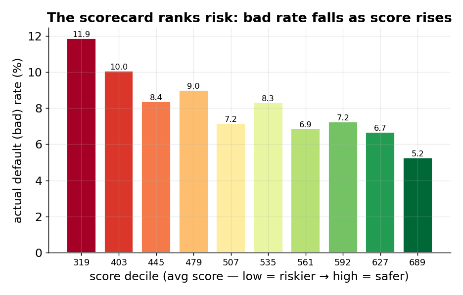
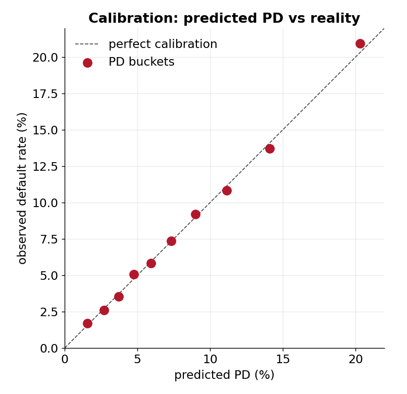
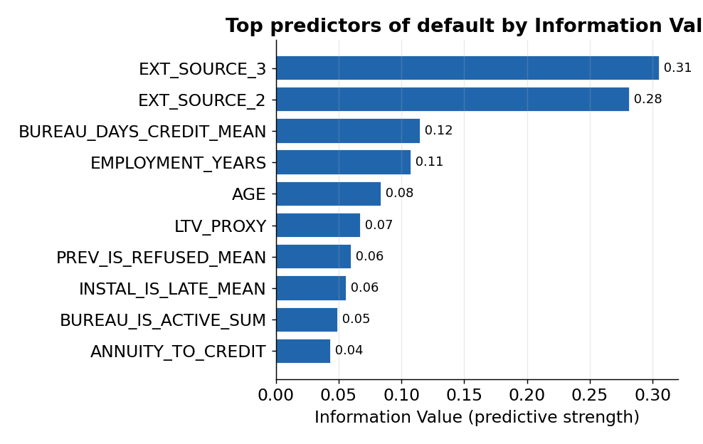
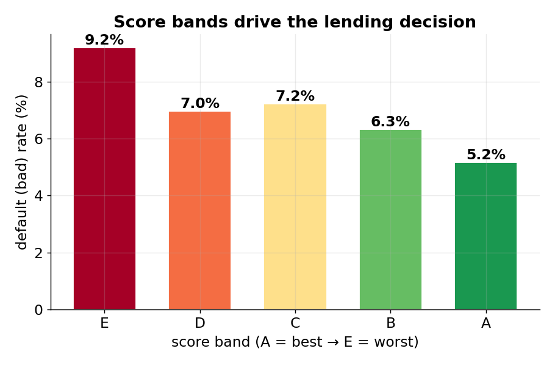
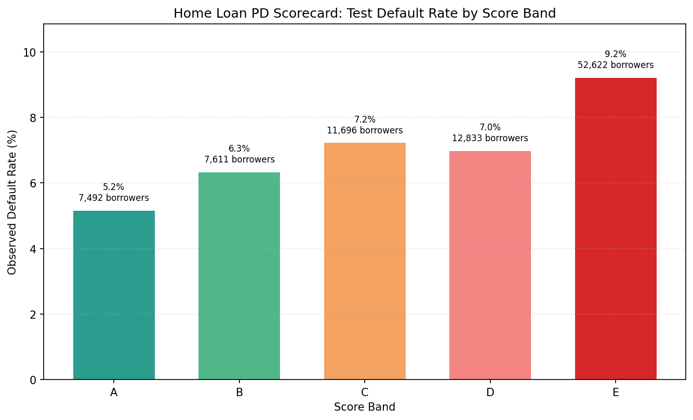

# Consumer Credit PD + EAD + Expected Loss (Scorecard Project)

This repository is a **consumer credit** PD (Probability of Default), EAD (Exposure at Default), and Expected Loss example in the broader credit-risk portfolio family. It uses the public Home Credit Default Risk dataset - an openly shareable consumer-lending dataset of borrower application, bureau, and repayment behaviour - and turns it into an interpretable origination scorecard plus an exposure-and-loss layer, with validation, monitoring, and documentation outputs.

The repo is designed as a public portfolio project rather than a production bank model. The workflow is explainable, notebook-led, and built to show how an interpretable scorecard and a simple expected-loss view can support lending discussion, policy cut-offs, and ongoing model review.

## What this repo is

This project shows how a bank-style **consumer credit** PD scorecard - extended with EAD and Expected Loss - can be structured using transparent methods:

- baseline logistic regression on application-level data
- feature enrichment from bureau and prior behavioural tables
- WOE / IV scorecard development for interpretability
- score scaling, score bands, and borrower-level PD outputs
- EAD / CCF and a PD x LGD x EAD expected-loss view on the credit-card segment (methodology demonstration only - see the EAD data-quality note under Limitations)
- validation, monitoring, governance, and policy framing

## Results at a glance

| Metric | Result | Plain meaning |
|---|---|---|
| Scorecard discrimination (AUC) | **0.71** | How well it separates defaulters from non-defaulters (0.5 = coin-flip, 1.0 = perfect) |
| Gini / KS | **0.41 / 0.30** | Standard scorecard rank-ordering strengths — solid for an interpretable model |
| Bad rate, best vs worst score band | **5.2% → 9.2%** | The score cleanly orders risk, so cut-offs and approve/decline rules work |
| Calibration | predicted PD ≈ actual | Predicted default rates land on the observed rates across all PD buckets |

## Key charts

*All charts are regenerated from the committed scorecard outputs in [output/scorecard_outputs/](output/scorecard_outputs/)
by [reports/make_figures.py](reports/make_figures.py) — aggregated results only, no raw borrower records.*

### 1. The scorecard ranks risk (bad rate by score decile)

**What this shows:** the actual default rate in each tenth of the book, ordered from lowest score (riskiest) to highest (safest).
**Why it matters:** the bad rate falls steadily as the score rises — visual proof the scorecard separates good borrowers from bad, which is the whole job of an origination model.

### 2. Calibration — predicted PD vs reality

**What this shows:** each dot is a group of borrowers; its position compares the PD the model predicted against the default rate that actually happened.
**Why it matters:** the dots sit on the diagonal, so the PD numbers can be trusted as real probabilities — not just a ranking, but the right *level*.

### 3. Top predictors by Information Value

**What this shows:** which variables carry the most predictive signal (Information Value is the standard scorecard measure of a variable's strength).
**Why it matters:** the drivers are sensible and explainable — external bureau scores, credit history, employment, age — exactly what a reviewer expects to see.

### 4. Score bands drive the lending decision

**What this shows:** the five score bands and their default rates, which map to approve / manual-review / decline actions.
**Why it matters:** it turns the model into a usable policy — the chart a credit team would actually set cut-offs from.

*Full methodology and code: see the notebooks in [notebooks/](notebooks/).*

## Business context

Retail and consumer credit teams need an explainable Probability of Default model, and a view of how much is at risk if an account defaults, that can support:

- origination cut-offs and manual review rules
- borrower risk ranking and score bands
- exposure-at-default and expected-loss estimation
- validation and monitoring discussion
- governance and redevelopment triggers

This repo frames those needs in a public, recruiter-friendly way. The emphasis is on structure and business usability, not on chasing maximum benchmark performance from a black-box model.

## Data source

This project uses the **Home Credit Default Risk** dataset, a public dataset released by Home Credit Group for a Kaggle competition (2018).

- Source: Kaggle - [home-credit-default-risk competition](https://www.kaggle.com/competitions/home-credit-default-risk)
- Type: consumer credit (personal loans, point-of-sale finance, credit cards)
- Files used: `application_train`, `bureau`, `bureau_balance`, `previous_application`, `POS_CASH_balance`, `credit_card_balance`, `installments_payments`
- Note: used for portfolio demonstration only; not a real bank portfolio.

## Dataset and modelling approach

Primary data inputs:

- `data/` Home Credit consumer application data
- bureau history aggregates
- previous application, POS cash, instalment, and credit-card behavioural tables

Modelling flow:

1. Build a benchmark logistic regression on application data.
2. Aggregate linked external tables into customer-level features.
3. Screen variables using IV and risk-shape review.
4. Transform selected variables with WOE and refit an interpretable logistic scorecard.
5. Convert model output into points, scores, score bands, and PD estimates.
6. Review discrimination, deciles, calibration, stability, and governance notes.
7. Estimate EAD / CCF on defaulted credit-card accounts and combine PD x LGD x EAD into Expected Loss (demonstration only - a sanity check found the dataset's default flag is not a true economic default; see the EAD data-quality note under Limitations).

The retained scorecard metadata in `output/scorecard_outputs/07_scorecard_metadata.csv` shows a 12-feature scorecard with train and test AUC of about `0.706`.

## Why WOE / IV + logistic regression

This project uses a traditional scorecard stack (WOE binning, IV screening, logistic regression) because it suits a transparent, reviewer-facing portfolio piece:

- coefficients stay explainable, and each variable's risk direction can be checked through its bins
- score contributions convert cleanly into business-friendly points and score bands
- validation outputs (AUC, deciles, calibration, PSI, governance notes) are easy to interpret in an interview or review setting

The goal is a coherent, defensible underwriting workflow, not maximum benchmark performance from a black-box model.

## Key outputs

- notebook workflow in `notebooks/`
- IV summary in `output/scorecard_outputs/01_iv_summary.csv`
- scorecard points table in `output/scorecard_outputs/04_scorecard_points.csv`
- scored test sample in `output/scorecard_outputs/06_test_scored.csv`
- scorecard metadata in `output/scorecard_outputs/07_scorecard_metadata.csv`
- EAD / CCF / Expected-Loss snapshot in `output/ead_summary.csv` (demonstration figures, not credible loss estimates - see Limitations)
- PD calibration test (binomial + Hosmer-Lemeshow, traffic-light flags) in `output/scorecard_outputs/13_calibration_test.csv`
- PD margin-of-conservatism overlay (pre/post-MoC grade PDs) in `output/scorecard_outputs/14_pd_moc_overlay.csv`
- recession stress test (baseline vs mild/severe portfolio EL) in `output/scorecard_outputs/15_stress_test.csv`
- recruiter-facing chart asset in `output/readme_assets/home_loan_score_band_default_rates.png`

## Notebook map

| Notebook | What it covers |
|---|---|
| `HomeCredit_00_Logistic_with_Applicationdata.ipynb` | Baseline logistic regression on application data |
| `HomeCredit_01_External_Data_Preparation.ipynb` | Prepare and aggregate linked external tables |
| `HomeCredit_02_Logistic_With_External_Features.ipynb` | Logistic model with external features |
| `HomeCredit_03_PD_Scorecard_Build.ipynb` | WOE / IV scorecard build, points and PD |
| `HomeCredit_04_PD_Scorecard_Validation_and_Business_Use.ipynb` | Validation and business use |
| `HomeCredit_05_PD_Scorecard_Advanced_Monitoring_and_Stability.ipynb` | Monitoring and stability |
| `HomeCredit_06_PD_Scorecard_Model_Risk_and_Portfolio_Governance.ipynb` | Model risk and governance |
| `HomeCredit_07_PD_Scorecard_Model_Documentation_Backtesting_Policy.ipynb` | Documentation, backtesting, policy |
| **`08_EAD_CCF.ipynb`** | **EAD, CCF, benchmarked LGD range, and account-level PD x LGD x EAD Expected Loss** - framework-aligned (onset anchor, receivables-inclusive EAD, no clipping/dropping, ULF/LF/BF basis, long-run/downturn/MoC/floor); still surfaces the data-quality finding that the 90+ DPD flag is not a true economic default |
| **`09_Stress_Testing.ipynb`** | **Mild + severe recession stress test** on portfolio Expected Loss (PD/LGD/EAD multipliers, no-diversification convention, management-action and reverse-stress notes) |

## Repo structure

- `data/`: public source data used by the notebooks
- `notebooks/`: numbered build, validation, monitoring, governance, and EAD walkthroughs
- `output/`: retained scorecard tables, README assets, and the EAD / Expected-Loss snapshot (`ead_summary.csv`)
- `src/`: reusable WOE, validation, calibration, PSI, and monitoring helpers
- `Concepts/`: private background PDFs and legacy working material not used as the public review path

## Recommended review path

1. Read this `README.md` for the public overview, methodology, and limitations.
2. Review the notebooks from `HomeCredit_00_Logistic_with_Applicationdata.ipynb` through `HomeCredit_07_PD_Scorecard_Model_Documentation_Backtesting_Policy.ipynb` in numeric order.
3. Finish with `08_EAD_CCF.ipynb` for the EAD / Expected-Loss layer and its data-quality finding.

For the underlying theory and mathematics - WOE / IV, score scaling, the validation metrics, and the per-notebook implementation logic - see the companion deep-dive in [`Scorecard_README.md`](Scorecard_README.md).

**Quick review option** - if you don't want to open every notebook:

1. `README.md`
2. `output/scorecard_outputs/07_scorecard_metadata.csv` (scorecard summary and AUC)
3. `output/scorecard_outputs/04_scorecard_points.csv` (points table)
4. `output/scorecard_outputs/06_test_scored.csv` (scored borrowers)
5. notebooks `03` (scorecard build) and `04` (validation and business use)

## How to run

1. Install dependencies with `pip install -r requirements.txt`.
2. Open the notebooks in Jupyter and run them in numeric order (00-07 build/validate/govern the PD scorecard; `08` is EAD/CCF/LGD/EL; `09` is the stress test).
3. Regenerate the PD calibration test and MoC overlay from the committed aggregates (no raw data needed) with `python reports/make_pd_calibration.py`.

## Limitations / Demo-only note

- The repo uses the public Home Credit dataset rather than a real lender's portfolio.
- It is a portfolio demonstration of consumer scorecard and expected-loss methods, not a live bank underwriting model.
- Cut-offs, score bands, and governance thresholds are illustrative.
- Reject inference, calibration, and monitoring are presented as structured portfolio notes rather than production controls.
- No LGD model - the dataset has no recovery data, so LGD is an external-benchmark assumption, now carried as a **base/downturn range (0.75 / 0.85, within a ~0.65-0.90 unsecured-consumer band)** with the Expected Loss shown across the range, rather than a single 0.70 point.
- PD is built on the application book and EAD on the credit-card segment; the Expected-Loss example now **links each card account to its own borrower PD** (via `SK_ID_CURR`), but the scorecard test split only covers part of the book (~25% link coverage), so it remains account-level-but-illustrative rather than a fully-linked portfolio loss model.
- **EAD data-quality note - the EAD/CCF/Expected-Loss layer is a methodology demonstration, not a credible loss estimate on this data.** A sanity check found the credit-card `SK_DPD` (days-past-due) counter accumulates and never resets, so the 90+ DPD default flag does **not** represent economic default: the flag fires late on a tiny residual, the pre-default peak balance sits ~10 months earlier in a fully-current period, and some accounts even revive with large balances after their flagged "default". The exposure figures and the `EL = PD x LGD x EAD` example are kept only to show the mechanics. **Properly-anchored EAD - built on a clean, non-reviving default definition - is demonstrated in the companion Freddie Mac mortgage project.**

### Framework alignment (APS 113 / APG 113 / Basel CRE36 / WP14)

This project was aligned to the PD / EAD / LGD / EL / stress frameworks. The table separates what is
**now implemented in code/outputs** from what is **documented-only** (a portfolio demo cannot operationalise
everything, but each documented item names the rule it satisfies).

**Now implemented (code + regenerated outputs):**

- **5 bps PD floor** - `src/calibration.py: apply_pd_floor` (APS 113 Att B para 1).
- **PD calibration test** - per-grade one-sided **binomial** + overall **Hosmer-Lemeshow** with traffic-light
  flags -> `13_calibration_test.csv` (Part 5.3). On the calibrated PD every grade passes the binomial
  under-estimation test; H-L flags that the calibrated level is conservative vs the benign test window.
- **PD margin of conservatism** - additive +15% overlay on grade PDs -> `14_pd_moc_overlay.csv` (Step 10 / CRE36.67).
- **EAD methodology fixes** (notebook 08): onset-of-delinquency primary anchor (EAD-3); receivables-inclusive,
  floor-respecting EAD (EAD-2, Basel CRE36.89); **no clipping of observed CCF and no dropping of over-limit
  accounts**, with a ULF/LF/BF basis switch in the high-utilisation region of instability (EAD-1,
  CRE36.95(2)); long-run count-weighted CCF, downturn CCF, MoC and the allowed homogeneity exclusion (EAD-4).
- **Benchmarked LGD range** and **account-level EL** across that range (LGD-1, EL-1).
- **Recession stress test** - mild + severe scenarios on portfolio EL -> `15_stress_test.csv` (Basel CRE36.51 / APS 220).

**Documented-only (correct treatment stated, not operationalised on demo data):**

- Rating philosophy (PIT-leaning, long-run-calibrated; APG 113 para 73 caveat), retail-**pool** framing,
  use test, development/validation independence, override policy, and reject inference - notebook 06.
- Best-estimate-of-EL for defaulted accounts and EL-vs-provisions framing - notebook 08.
- Management actions/contingency, reverse-stress framing, and independent validation of the stress framework - notebook 09.
- The binomial / Hosmer-Lemeshow **independence caveat** (WP14): both tests understate Type-I error under
  correlated defaults, so amber/red flags are review prompts, not hard pass/fail.

The calibration test and MoC overlay regenerate with `python reports/make_pd_calibration.py`; notebooks 08
and 09 regenerate their own CSVs when run.

## License

Released under the MIT License — free to read, run, and reuse with attribution.
